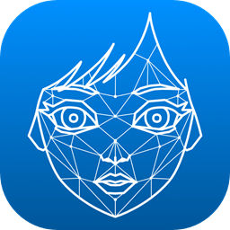
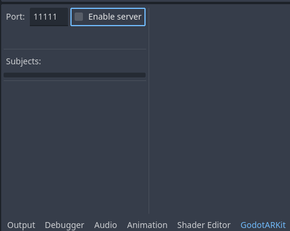
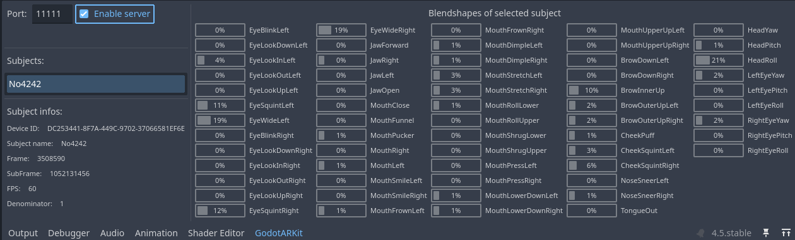

# GodotARKit: Real-time facial Mocap! 
 

GodotARKit is a Godot 4 plugin designed to stream real-time facial motion capture from an ARKit UDP stream. Download LiveLinkFace on your phone, and get access to all the blendshapes of your faces via a singleton. Also work in game.

The blendshapes can be connected to your 3D model to animate them in real-time.

https://github.com/user-attachments/assets/45f041b1-7f9d-4cc0-8c7c-4ef02c20cb1f

# Features
- **Editor integration**: Built-in editor panel accessible from the bottom panel provides real-time monitoring of connected devices, live blendshape value visualization, packet frame information, and error status display.
- **Seamless access**: All the blendshapes, from an autoload.

# Setup

1. use your phone to create a UDP server (typically via LiveLinkFace), make your target your godot computer **LOCAL** IP. Use the port you want.
2. Open the addon bottom panel, select your port, enable the server.

3. Your device should appear in the subjects list automatically and show you the result.
4. Stop the server when hitting play, you may want to start it in code, in this case the current one may already listen to the same port. This tool is just here to help you debug.



# Example
#### Animate your MeshInstance3D with one loop.
> This is the code used for the video demo.

```gdscript
extends Node3D

@onready var face_mesh_instance: MeshInstance3D = $Armature/Skeleton3D/face
@onready var skeleton: Skeleton3D = $Armature/Skeleton3D
@export var neck_bone_name:String = 'head'
@onready var anim_tree: AnimationTree = $AnimationTree

var neck_bone:int
var base_neck_rot:Quaternion


func _init() -> void:
	# Start the server on the port of your choice
	ARKitSingleton._server.change_port(11111)
	ARKitSingleton._server.start()


func _ready() -> void:
	neck_bone = skeleton.find_bone(neck_bone_name)
	base_neck_rot = skeleton.get_bone_pose_rotation(neck_bone)


func _process(_delta: float) -> void:
	var first_subject: ARKitSubject

	# Check if at least one subject (ARKit UDP service screaming at you) exists
	if len(ARKitSingleton._server.subjects.keys()) == 0:
		return

	# Select the first subject like a brute
	for subject: ARKitSubject in ARKitSingleton._server.subjects.values():
		first_subject = subject
		break

	# Change each blendshape of your model
	for i in range(first_subject.packet.number_of_blendshapes):
		var blendshape_name: String = ARKitServer.blendshape_string_mapping[i]
		var blendshape_value: float = first_subject.packet.blendshapes_array[i]


		# The classic 52 blendshapes of the face
		if i <= ARKitServer.BlendShape.TONGUE_OUT:
			set_blend_shape(face_mesh_instance, blendshape_name, blendshape_value)
		else:
			break
		
		# The blendshapes related to the head rotation
		var head_yaw: float = first_subject.packet.blendshapes_array[ARKitServer.BlendShape.HEAD_YAW]
		var head_pitch: float = first_subject.packet.blendshapes_array[ARKitServer.BlendShape.HEAD_PITCH]
		var head_roll: float = first_subject.packet.blendshapes_array[ARKitServer.BlendShape.HEAD_ROLL]
		skeleton.set_bone_pose_rotation(neck_bone, base_neck_rot * Quaternion.from_euler(Vector3(-head_pitch, -head_yaw, -head_roll)))
	
		# The ones related to eyes rotation (It's hacky here, both eyes behave the same, so you can't be crosse-eyed). Do better
		var left_eye_yaw: float = first_subject.packet.blendshapes_array[ARKitServer.BlendShape.LEFT_EYE_YAW]
		var left_eye_pitch: float = first_subject.packet.blendshapes_array[ARKitServer.BlendShape.LEFT_EYE_PITCH]
		var eyes_pos := Vector2(left_eye_yaw*PI/2, -left_eye_pitch*PI/2)
		anim_tree.set('parameters/blend_position', eyes_pos)


static func set_blend_shape(mesh_instance: MeshInstance3D, blendshape_name: String, blendshape_value: float) -> void:
	var new_name: String = lowercase_first_letter(blendshape_name)
	var blend_shape_idx: int = mesh_instance.find_blend_shape_by_name(new_name)
	if blend_shape_idx == -1:
		push_warning("blendshape: ", new_name, " not found in node: ", mesh_instance)
		return # Not found
	mesh_instance.set_blend_shape_value(blend_shape_idx, blendshape_value)
```

# Documentation
#### Blendshapes String enum: 
```gdscript
# For better convenience, name your 3D model shapekeys correctly (PascalCase)
# and just do a loop of the key/values of ARKitServer.blendshape_string_mapping
var blendshape_name: String = ARKitServer.blendshape_string_mapping[ARKitServer.BlendShape.EYE_LOOK_IN_LEFT]
# Use another system to rotate the head/eyes
```
#### Blendshapes int enum (indexes of ARKitPacket.blendshapes_array):
```gdscript
# You can use it as indexes of the ARKitPacket float32 array
enum BlendShape {
	EYE_BLINK_LEFT = 0,
	EYE_LOOK_DOWN_LEFT = 1,
	EYE_LOOK_IN_LEFT = 2,
	EYE_LOOK_OUT_LEFT = 3,
	EYE_LOOK_UP_LEFT = 4,
	EYE_SQUINT_LEFT = 5,
	EYE_WIDE_LEFT = 6,
	EYE_BLINK_RIGHT = 7,
	EYE_LOOK_DOWN_RIGHT = 8,
	EYE_LOOK_IN_RIGHT = 9,
	EYE_LOOK_OUT_RIGHT = 10,
	EYE_LOOK_UP_RIGHT = 11,
	EYE_SQUINT_RIGHT = 12,
	EYE_WIDE_RIGHT = 13,
	JAW_FORWARD = 14,
	JAW_RIGHT = 15,
	JAW_LEFT = 16,
	JAW_OPEN = 17,
	MOUTH_CLOSE = 18,
	MOUTH_FUNNEL = 19,
	MOUTH_PUCKER = 20,
	MOUTH_RIGHT = 21,
	MOUTH_LEFT = 22,
	MOUTH_SMILE_LEFT = 23,
	MOUTH_SMILE_RIGHT = 24,
	MOUTH_FROWN_LEFT = 25,
	MOUTH_FROWN_RIGHT = 26,
	MOUTH_DIMPLE_LEFT = 27,
	MOUTH_DIMPLE_RIGHT = 28,
	MOUTH_STRETCH_LEFT = 29,
	MOUTH_STRETCH_RIGHT = 30,
	MOUTH_ROLL_LOWER = 31,
	MOUTH_ROLL_UPPER = 32,
	MOUTH_SHRUG_LOWER = 33,
	MOUTH_SHRUG_UPPER = 34,
	MOUTH_PRESS_LEFT = 35,
	MOUTH_PRESS_RIGHT = 36,
	MOUTH_LOWER_DOWN_LEFT = 37,
	MOUTH_LOWER_DOWN_RIGHT = 38,
	MOUTH_UPPER_UP_LEFT = 39,
	MOUTH_UPPER_UP_RIGHT = 40,
	BROW_DOWN_LEFT = 41,
	BROW_DOWN_RIGHT = 42,
	BROW_INNER_UP = 43,
	BROW_OUTER_UP_LEFT = 44,
	BROW_OUTER_UP_RIGHT = 45,
	CHEEK_PUFF = 46,
	CHEEK_SQUINT_LEFT = 47,
	CHEEK_SQUINT_RIGHT = 48,
	NOSE_SNEER_LEFT = 49,
	NOSE_SNEER_RIGHT = 50,
	TONGUE_OUT = 51,
	HEAD_YAW = 52,
	HEAD_PITCH = 53,
	HEAD_ROLL = 54,
	LEFT_EYE_YAW = 55,
	LEFT_EYE_PITCH = 56,
	LEFT_EYE_ROLL = 57,
	RIGHT_EYE_YAW = 58,
	RIGHT_EYE_PITCH = 59,
	RIGHT_EYE_ROLL = 60,
}
```

# Troubleshooting
#### Device Not Connecting
- Verify same Wi-Fi network.
- Check computer's local IP address.
- Ping yourself both ways.
- Ensure port matches (default: 11111).
- Check firewall UDP settings.
- Verify "Start Server" is enabled.
- Check if the addon creator is to blame.

# Credits
Developed for the Godot community by: **Jules Neghnagh--Chenavas**.

# Contributing
DO IT! I surely made errors, especially on the UI. Didn't even test with more than one device. It's also my first plugin.

# License
This addon has been released under the **MIT License**.
